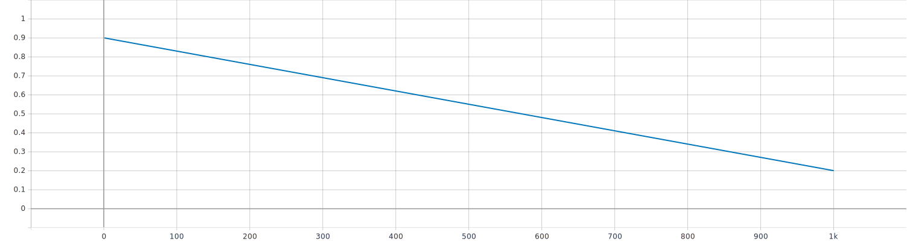
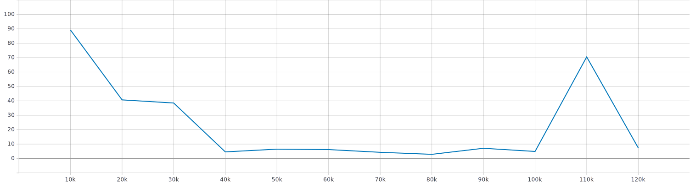
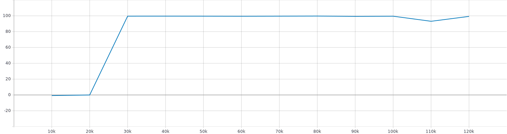
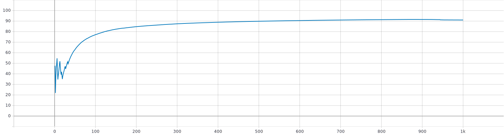
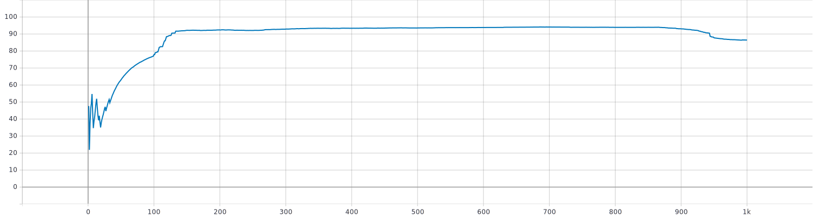
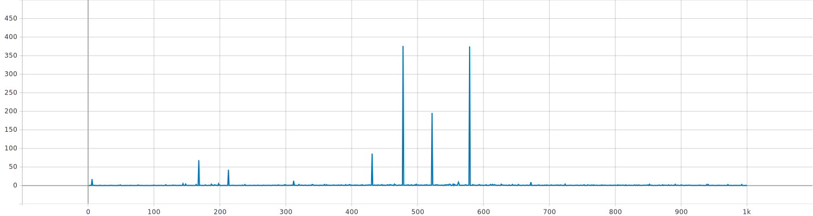
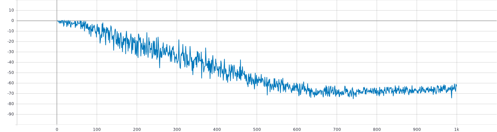

# NN DDPG Implementation
The first step towards the objective of the Master Thesis was the implementation of the algorithm in **[1]**.

This first version is not capable to elaborate images but only continuous environments of OpenAI Gym such as **MountainCarContinuous-v0**. 

The next step will be the implementation of the same algorithm using images as input, which is a similar context to the one of the Anki Cozmo environment.

## Plots
These plots refers to one run of the DDPG algorithm using the **MountainCarContinuous-v0** environment provided by OpenAI Gym
## Comments about the results
As reported in OpenAI Gym Leaderboards the problem is considered solved if the mean of the last 100 episode is greater than 90. This code reaches this threshold after about 130 episode ([plot](https://github.com/pieromacaluso/A-Study-Of-Reinforcement-Learning/blob/master/source_code/NN_DDPG_implementation/README.md#reward-mean-over-last-100)). Taking into account that we are using a simple NN this is an accettable result, therefore it can be used as a good baseline to start the evolution of our project.

### Hyperparameters
#### Epsilon Decay

### Test
#### Steps mean

#### Reward mean
\
### Train
#### Reward Mean

#### Reward Mean over last 100

### Loss
#### Critic (Value) Loss

#### Actor (Policy) Loss 

## References
**[1]** [Learning to Drive in a Day](https://arxiv.org/pdf/1807.00412.pdf) (Sep 2018) by Alex Kendall, Jeffrey Hawke, David Janz, Przemyslaw Mazur, Daniele Reda, John-Mark Allen, Vinh-Dieu Lam, Alex Bewley & Amar Shah

**[2]** [Continuous Control with Deep Reinforcement Learning](https://arxiv.org/pdf/1509.02971.pdf) (Feb 2016) by Timothy P. Lillicrap, Jonathan J. Hunt, Alexander Pritzel, Nicolas Heess, Tom Erez, Yuval Tassa, David Silver & Daan Wierstra
